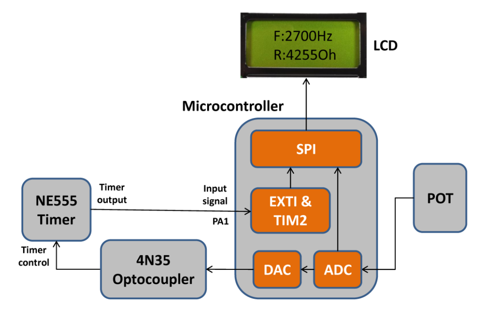

CENG 355
======

For [CENG 355 - Microprocessor-Based Systems](http://www.ece.uvic.ca/~ceng355/lab/) at UVic.

Complete code for a microcontroller that

1. Reads an analogue voltage level
1. Outputs an analogue control signal to a 555 timer (via optocoupler) based on the input voltage
1. Measures the oscillation frequency of the 555 timer
1. Displays controller resistance (determined from input voltage) and timer frequency on an LCD

